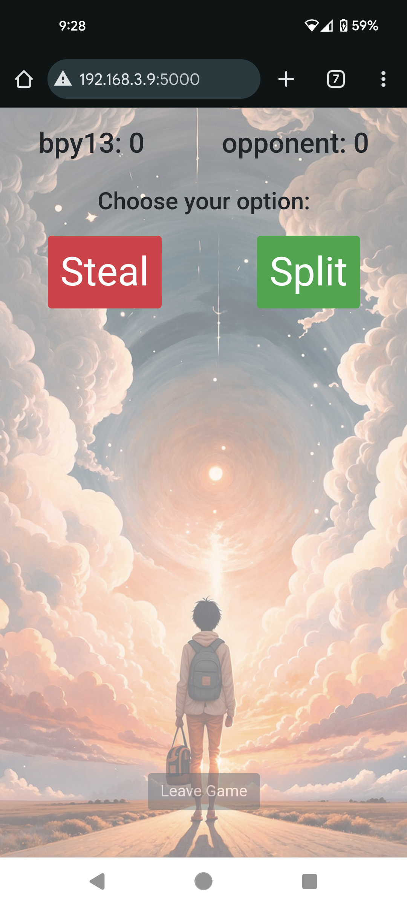
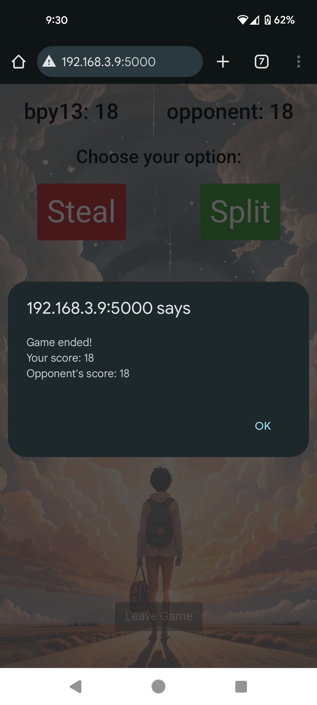

# Prisoner's Dilemma Game Lobby

A simple Flask-SocketIO server that hosts a game lobby for multiple rounds of the classic Prisoner's Dilemma. This server allows players to compete against each other in a dynamic game environment.

## Game Rules

The Prisoner's Dilemma is a classic game theory scenario where two players can either cooperate or betray each other. The outcomes are as follows:
- If both players cooperate, they both receive 3 points.
- If one betrays and the other cooperates, the betrayer receives 5 points and the cooperator receives 0 point.
- If both betray, they both receive 1 point.

Each player participates in multiple rounds, randomly between 5 to 9 rounds. The average score across these rounds is used to determine the winner at the end of the game. The leaderboard displays the players' average scores.

## Screenshots

<p align="center">
  
  
  
  
</p>

## Prerequisites
- Python3
- Flask
- Flask-SocketIO

## Installation

1. Clone the repository:
    ```sh
    git clone https://github.com/bpy13/prisoners_dilemma.git
    cd prisoners_dilemma
    ```

2. Install the required packages:
    ```sh
    pip install Flask Flask-SocketIO
    ```

## Usage

1. Run the server:
    ```sh
    python app.py
    ```

2. Navigate to `http://<your-ip-address>:5000` with your device.

## License

This project is licensed under the MIT License.
